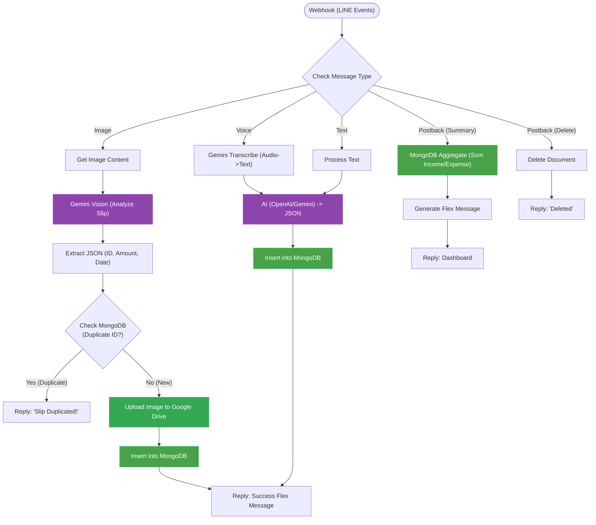

# NongMas - AI Financial Assistant Chatbot

> **"Financial tracking made conversational."**
> NongMas is an advanced LINE Chatbot powered by **Generative AI** that automates expense tracking via Text, Image (Slips), and Voice.

## Key Features

### 1. Multi-Modal Expense Tracking
* **Text:** "Lunch 50 baht" -> AI extracts `Category: Food`, `Amount: 50`.
* **Voice:** Send a voice message -> Gemini Transcribes -> AI Process -> Save to DB.
* **Image (Slips):** Upload a bank slip -> Gemini Vision extracts `Date`, `Amount`, `TransacID` -> Checks for duplicates -> Saves automatically.

### 2. Smart Duplicate Protection
* Before saving a slip, the system checks **MongoDB** for the unique `transaction_id`.
* **If duplicate:** Responds with "Duplicate slip detected!" and rejects the entry.
* **If new:** Uploads the slip image to **Google Drive** (organized by UserID) and logs the transaction.

### 3. Interactive Dashboard
* **Daily/Monthly Summary:** Calculates income, expense, and balance in real-time using MongoDB Aggregation pipelines.
* **Rich UI:** Responds with a beautiful **LINE Flex Message** dashboard.
* **Actionable:** Users can click to view details or delete specific transactions directly from the chat.

## Workflow Diagram

This diagram represents the actual logic flow from the n8n workflow:

## Tech Stack
- Core Engine: n8n (Self-hosted/Cloud)
- Messaging: LINE Messaging API (Webhook, Flex Message)
- Database: MongoDB (Transactions, Logs)
- Storage: Google Drive (Slip Images)
- AI Models:
    - Google Gemini 2.5 Flash: For Image Analysis (OCR) & Voice Transcription.
    - OpenAI / Gemini: For Natural Language Processing (Intent Classification).

## Usage Examples
| Input Type | Example | Result (Database) |
| :--- | :--- | :--- |
| **Text** | "Paid electricity bill 1,200 baht" | `Class: Bill`, `Amount: 1200`, `Type: Expense` |
| **Text** | "Salary came in 30,000" | `Class: Salary`, `Amount: 30000`, `Type: Income` |
| **Voice** | (Speaking) "Bought coffee 60 baht" | `Class: Beverage`, `Amount: 60`, `Type: Expense` |
| **Image** | [Upload K-Plus Slip] | Extracts `TransacID`, `Time`, saves image to Drive, logs entry. |

## Demo & Screenshot

<table>
  <tr>
    <th width="33%">ส่งข้อความ (Text)</th>
    <th width="33%">ส่งสลิป (Slip OCR)</th>
    <th width="33%">ส่งเสียง (Voice)</th>
  </tr>
  <tr>
    <td valign="top">
      
    </td>
    <td valign="top">
      
    </td>
    <td valign="top">
      
    </td>
  </tr>
  <tr>
    <th>สรุปรายเดือน (Dashboard)</th>
    <th>ดูรายการวันนี้ (Daily View)</th>
    <th></th> </tr>
  <tr>
    <td valign="top">
      
    </td>
    <td valign="top">
      
    </td>
    <td></td> </tr>
</table>

## Installation & Setup
1. Import Workflow: Import NongMas_line_chatbot.json into n8n.
2. Credentials: Set up the following credentials in n8n:
   - LINE Developer: Access Token & Channel Secret.
   - Google Cloud: OAuth2 for Google Drive & Gemini API.
   - MongoDB: Connection String (Atlas/Local).
   - OpenAI: API Key (if enabled).
3. Drive Folder: Replace the Folder ID in the "Search files and folders" node with your specific Google Drive Folder ID.
4. Webhook: Connect the n8n Webhook URL to your LINE Developers Console.
