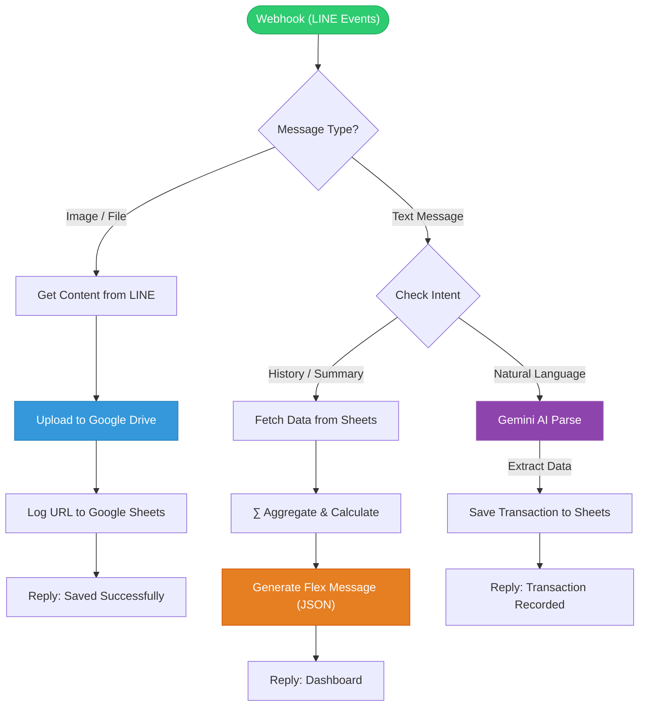

# NongMas - Smart LINE Chatbot Workflow

> **"Financial tracking made conversational."**
> NongMas is a smart LINE Chatbot that turns natural language into structured data using **Generative AI**. No more manual forms—just chat, and let the AI handle the rest.

NongMas is an automated workflow powered by n8n, designed to be your personal assistant via LINE Official Account (OA). It features AI-driven expense tracking and automatic file archiving.

## Key Features
1. AI Expense Tracker
- Uses Google Gemini AI to process natural language messages (e.g., "Lunch 50 THB", "Salary received 20,000").
- Automatically categorizes transactions as Income or Expense.
- Logs data directly into Google Sheets.

2. Auto File Archiver
- When a user sends an Image or File (PDF/Doc) to the chat.
- The system automatically uploads it to Google Drive.
- A log containing the file's URL is saved to Google Sheets for easy retrieval.

3. Dashboard & History
- Supports commands to view "History" or "Summary".
- Fetches data from Google Sheets, calculates totals, and responds with a beautiful Flex Message dashboard.

## Workflow Diagram
This diagram illustrates the logic flow extracted from the n8n JSON file:

    
## Tech Stack & Integrations
- Core Engine: n8n (Workflow Automation)
- Messaging Platform: LINE Messaging API (Webhook & Flex Message)
- Database: Google Sheets
- File Storage: Google Drive
- AI Model: Google Gemini (For Natural Language Processing)

## Installation & Setup
1. Import Workflow:
- Open your n8n instance.
- Create a new workflow.
- Select Import from File and choose NongMas_line_chatbot.json.
2. Configure Credentials: You need to set up the following credentials in n8n:
- LINE Developer: Access Token and Channel Secret.
- Google Cloud: OAuth2 connection for Google Sheets and Google Drive.
- Google Gemini: API Key.
3. Set Webhook:
- Copy the URL from the Webhook node in n8n.
- Paste it into the Webhook URL setting in the LINE Developers Console.
4. Prepare Google Sheets:
- Create a sheet for Transactions (Columns: Date, Item, Amount, Type, Category).
- Create a sheet for File Logs (Columns: File Name, Drive Link, Upload Date).
- Note: Update the Sheet ID in the Google Sheets node to match your file.
